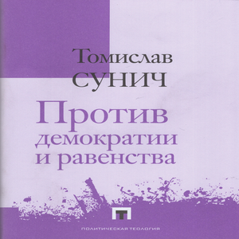

**[Buy](https://www.amazon.com/Homo-Americanus-Child-Postmodern-Age/dp/1912079399)**

_Homo Americanus_ is a powerful investigation into the origins and dynamics of Americanism. Drawing from many long-forgotten or suppressed sources in the fields of literature, history, anthropology and philosophy, this book represents an interdisciplinary critique of America’s founding myths, its riddled present, and its questionable tomorrow.

Dr. Tomislav Sunic casts strong light on many facets of the American question: the postmodern American psychology driven by a sense of Jewish-inspired chosenness, America’s linguistic manipulations, its techno-scientific religion of boundless progress, and the American geopolitical reality as a menacing and self-destructive hegemon, which puts not only the survival of its own European legacy at risk, but also the heritage of all European peoples worldwide.

**[Buy](https://www.amazon.com/Postmortem-Report-Cultural-Examinations-Postmodernity/dp/1912079771)**

Tomislav Sunic, _Postmortem Report: Cultural Examinations from Postmodernity_ (Arktos, 2017), preface Kevin MacDonald

Along with his other published works, Tomislav Sunic is steadily turning his attention to a wide variety of topics affecting Europe’s cultural and political heritage, including such sacred and less sacred cows, as liberalism, the artistic legacy of the Third Reich, the religion of multiculturalism, the pathology of Communism, the works of Spengler and Schmitt, as well as the history of a failed multicultural entity known as Yugoslavia. _Postmortem Report_ invites us to reassess the European past, from Antiquity to Modernity, through the lenses of a cultural pessimist. This collection of essays and translations will appeal to anyone who wishes for an honest, surgical approach to these topics, freed from the liberal academic agenda. It is a vital addition to Sunic’s prose.

**[Buy](https://www.amazon.com/Titans-are-Town-Novella-Accompanying/dp/1912079518)**

_Titans are in Town_ consists of a novella and cultural essays by Dr. Tomislav Sunic. In the novella and his essays, Sunic discusses the state of Europeans in their postmodern wasteland. Confronted by endless interracial chaos, Europe longs for the return of Titans. Based on Friedrich Georg Jünger’s seminal 1944 work _Die Titanen_, the dormant Titans represent the only salvation for slumbering Europeans. The Titans’ unexpected return from mid-earth will start a resumption of Europe’s greatness.

**[Buy](https://www.amazon.com/Homo-americanus-Child-Postmodern-Age/dp/1419659847)**

In this book, prefaced by Professor Kevin MacDonald, Dr. Tomislav Sunic describes the origins and dynamics of America's founding myths. Quoting and translating from many long-forgotten or suppressed sources from the fields of literature, history, anthropology and philosophy, the book represents an interdisciplinary compendium dealing with the topic of Americanism. The genealogy of early Calvinist Puritanism mixed with the techno-scientific religion of boundless economic progress and legally veiled in the obscure para-Biblical and Jewish-inspired sense of political self-chosenness, created a system that has little in common with its original design. Postmodern Americanism, with its abstract theories of multiculturalism and its global desire for world improvement, turned America into a menacing and self-destructive continent that puts not only the survival of America's European heritage at risk, but threatens the heritage of other peoples worldwide as well.

**[Buy](https://www.amazon.com/Against-Democracy-Equality-European-Right/dp/1907166254)**

Against Democracy and Equality was the first book ever published in the English language on the European New Right, and it remains an indispensable introduction to a school of thought which remains a vibrant force in the understanding of European politics. Dr. Sunic examines the principal themes which have concerned the thinkers of the New Right since its inception by Alain de Benoist in 1968, such as the problematic nature of the label 'New Right' for a school which sees itself as being beyond traditional concepts of both the left and the right; its revolutionary political philosophy; its conception of history in terms of cycles; its attitude toward democracy, capitalism and socialism; and its endorsement of 'pagan' spirituality. He also discusses the significance of some of the older authors who have been particularly influential on the development of the movement, such as Oswald Spengler, Carl Schmitt and Vilfredo Pareto. This new edition of Against Democracy and Equality has been completely re-edited, and offers new prefaces by both Dr. Sunic and the principal theorist of the European New Right, Alain de Benoist. Also included for the first time is the Manifesto for a European Renaissance, which highlights the positions of the New Right as it enters a new millennium.

**[Buy](https://www.amazon.fr/Croatie-pays-par-d%C3%A9faut/dp/0955513294)**

Dans son livre La Croatie: un pays par défaut?, Tomislav Sunic décrit le phénomène de la « soudaineté » et du « hasard » dans la notion du politique chez les peuples dépourvus d’États stables. En s’appuyant sur de nombreux ouvrages et en citant les écrivains allemands, français, croates et américains, il s’intéresse plus particulièrement au cas de la Croatie avant d’élargir sa réflexion et de passer en revue les « fausses identités » qui interviennent dans la construction des nationalismes européens. Ce livre important présente les identités nationales par « défaut » ou par « procuration ». Les victimologies et les hagiographies communistes, véhiculées par une certaine gauche occidentale et les médias hyperréels, ont été volens nolens à l’origine de l’exacerbation du conflit en ex-Yougoslavie — comme elles le seront peut être demain dans l’Union Européenne. L’ouvrage traite également du glissement sémantique des vocables à la mode, tels que « fascisme », « antifascisme », « racisme », etc., et présente au lecteur la face cachée d’une forme de posmodernité mimée à outrance par les Européens de l’Est.

**[Buy](https://www.amazon.com/Chroniques-Temps-Postmodernes-Fahrenheit-French/dp/1907847243)**

A l’aune des funestes figures engendrées par les systèmes idéologiques du siècle des grandes conflagrations (homo sovieticus et sa déclinaison balkanique, homo americanus), appréhendées dans un subtil jeu de miroirs, l’essayiste et conférencier américano-croate, nourri des travaux des "nouvelles droites" européennes, des penseurs transversaux et des meilleurs auteurs euro-américains, n’hésite pas à aborder avec courage et sérénité quelques-unes des problématiques essentielles, érigées en tabous de ces temps post-démocratiques d’unidimensionnalité néo-totalitaire, en posant les bonnes questions, avant de proposer de stimulantes pistes de réflexion et d’action.

**[Buy](https://www.superknjizara.hr/?page=knjiga&id_knjiga=100049790)**

Ova knjiga predstavlja zbir filozofskog nasljeđa konzervativne misli, koju je autor Tomislav Sunić prvi put napisao i obranio kao doktorsku disertaciju u Americi, 1988.g. Nakon 20 godina, knjiga konačni izlazi u trećem izdanju, ali ovaj puta na hrvatskom jeziku, u nakladi Hasanbegović. Evo konačno knjige, koja usprkos svoje velike bibliografije i citata, predstavlja lagano štivo za akademika i za gimnazijalca. U knjizi je riječ o autorima koji su znatno obilježili jednu epohu, a čiji sljedbenici će sutra imati glavnu riječ u stvaranju nove kulturne hegemonije.. Ujedno je Sunićeva knjiga idealno štivo za nacional-revolucionare, nacional-anarhiste i nacional-konzervativce - u svom postmodernom, arheofuturističkom izdanju, a koji odbacuju sve zastarjele nacionalizme i isključivosti. U dobi liberalno-komunističkog rasapa neka se Europljani vrate svojim pravim korijenima!

Europska nova desnica; Korijeni, ideje i mislioci

(prijevod: Nikica Barić)

Nakladnik Hasanbegović

Cijena: 100 kuna

Str. 338

ISBN. 978-953-99698-4-2

<hasanbegovic@net.hr>

[Buy](http://www.ladiffusiondulore.fr/home/792-la-croatie-un-pays-par-defaut-.html)

Tomislav Sunic décrit le phénomène de la « soudaineté » et des aléas dans la notion du politique chez les peuples dépourvus d’États stables. En s’appuyant sur de nombreux ouvrages d’écrivains allemands, français, croates et américains, il s’intéresse plus particulièrement au cas de la Croatie avant d’élargir sa réflexion et de passer en revue les « fausses identités » qui interviennent dans la construction des nationalismes européens. Ce livre incontournable présente les identités nationales par « défaut » ou par « procuration ».

Les victimologies et les hagiographies communistes, véhiculées par une certaine gauche occidentale et les médiats fantasmagoriques, ont été volens nolens à l’origine de l’exacerbation du conflit en ex-Yougoslavie — comme elles le seront peut être demain dans l’Union Européenne.

L’ouvrage traite également du glissement sémantique des vocables à la mode, tels que « fascisme », « antifascisme », « racisme », etc., et présente au lecteur la face cachée d’une forme de postmodernité mimée à outrance par les Européens de l’Est.

Cette nouvelle édition s’enrichit d’une introduction de Robert Steuckers nous éclairant sur le parcours de l’auteur et son œuvre.

[Kupi](https://mojaknjizara.hr/proizvod/posmrtni-izvjestaj/)

Kao i u svojim drugim objavljenim djelima, Tomislav Sunić neprestano usmjerava svoju pažnju na velik broj različitih tema koje utječu na europsku kulturnu i političku baštinu, uključujući i neke svete i manje svete krave, kao što su liberalizam, umjetnička baština Trećeg Reicha, religija multikulturalizma, patologija komunizma, djela Oswalda Spenglera i Carla Schmitta, kao i povijest propalog multikulturalnog entiteta poznatog kao Jugoslavija. "Posmrtni izvještaj" poziva nas da preispitamo europsku prošlost, od antike do modernizma, kroz objektiv kulturnog pesimizma. Ova zbirka eseja i prijevoda svidjet će se svakome tko želi iskren, kirurški pristup tim temama, oslobođen agende liberalne akademske zajednice.

[Kupi](https://ukronija.rs/proizvod/izvestaj-o-smrti-evrope/)

Izveštaj o smrti Evrope – Tomislav Sunić

Ova zbirka članaka i eseja, koji su ranije objavljivani u raznim časopisima i bave se temama u rasponu od rase preko književne kritike do filozofije istorije, više je nego dobrodošla. Tom Sunić je važan intelektualac, tim pre što ima tako malo intelektualaca, posebno u Evropi, spremnih da se suprotstave standardnim stavovima levice koji su dominirali intelektualnim diskursom po pitanjima kao što su rasa, multikulturalizam i Drugi svetski rat. Izveštaj o smrti Evrope – Post Mortem Report.

[Купи](https://gnosisbooks.ru/books/politologiya/protiv_demokratii_i_ravenstva/)

Книга хорватского исследователя Томислава Сунича с громким названием «Против демократии и равенства», вышедшая в 1990 году и выдержавшая несколько переизданий, посвящена так называемым европейским новым правым. За этим названием, данным движению прессой и политическими оппонентами, скрывается не политическая партия, а скорее школа мысли, включающая философов, художников, социобиологов, поэтов, писателей и ученых, чей основной предмет исследования и интереса критика эгалитаризма и идеи прогресса. Согласно Суничу, новые правые, не выступая против демократии и равенства как таковых, ставят под сомнение понятие и само название «либеральной демократии», а также доктрину эгалитаризма, подразумевающего навязывание идеи равенства там, где для него нет места. Автор реконструирует правую интеллектуальную традицию ХХ века, в качестве родоначальников которой он выделяет Карла Шмитта, Освальда Шпенглера и Вильфредо Парето, и последовательно разворачивает концепцию их преемников, современных новых правых: от позаимствованной у Грамши идеи культурной гегемонии до утверждения необходимости освобождения Европы от ложных идеалов и глобалистского воздействия.
