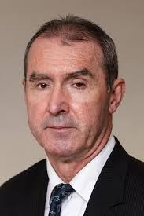

# Tomislav Sunić

Writer, translator and former Croatian diplomat. Born in Zagreb, where he lives
and works today. Doctorate in political science from Santa Barbara, and years of
teaching at California State University, the University of California and Juniata
College in Pennsylvania.
{ .hero-lede }

Books in English, French, Croatian, Serbian, Russian and Italian, and essays
written over four decades on the European New Right, cultural pessimism, the end
of Yugoslavia and the postmodern West.

[Books](books.md){ .md-button .md-button--primary }
[Library](biblioteka/europska-nova-desnica/index.md){ .md-button }
[Contact](contact.md){ .md-button }

## Blog posts by Tomislav Sunić
