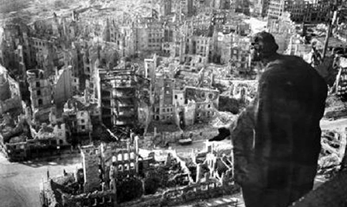
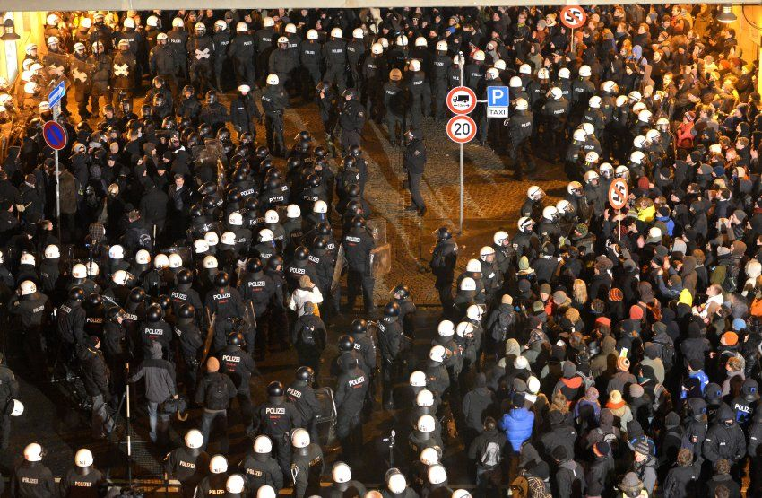

**The Occidental Observer, February 20, 2013.**

[View all posts by Tom Sunic](http://www.theoccidentalobserver.net/author/tomsunic/)

What follows below is the English translation of my speech in German which I was scheduled to deliver on February 13, 2013, around 7:00 PM in downtown Dresden. The commemoration of the Dresden February 13, 1945 victims was organized by “[Aktionsbündnis gegen das Vergessen](http://www.gedenkmarsch.de/dresden/archiv/trauermarsch-13-februar/)” (action committee against oblivion), NPD deputies and officials from the [local state assembly](http://www.npd-dresden.de/) in Dresden. There were 3,000 leftist antifa demonstrators. The city was under siege, cordoned off into sections by 4,000 riot policemen. The bulk of the nationalist participants, approximately 1,000, who had previously arrived at the central station, were split up and prevented from joining with our group at the original place of gathering. Toward 11:00 PM, when the event was practically over, the riot police did allow our small group of organizers and speakers to march past the barricades down to the central station. There were approximately 40 of us—mostly local NPD officials. On February 14, while still in Dresden, I provided more information as a guest on the Deanna Spingola’s RBN radio show: [Hour 1](http://216.240.133.177/archives32/Spingola/2013/02/Spingola_1_021413_110000.mp3), [Hour 2](http://216.240.133.177/archives32/Spingola/2013/02/Spingola_2_021413_120000.mp3).

Police separate groups of right-wing and left-wing demonstrators outside Dresden’s central train station.

## Human Improvement by Terror Bombardment

Dresden is only one single symbol of the Allied crime, a symbol unwillingly discussed by establishment politicians. The destruction of Dresden and its casualties are trivialized in the mainstream historiography and depicted as “collateral damage in the fight against the absolute evil — fascism.” The problem, however, lies in the fact that there was not just one bombing of one Dresden, but also many bombings of countless other Dresdens in all corners of Germany and in all parts of Europe. The topography of death, marked by the antifascists, is a very problematic issue for their descendants, indeed.

In today’s “struggle for historical memory,” not all victims are entitled to the same rights. Some victimhoods must be first on the list, whereas others are slated for oblivion. Our establishment politicians are up in arms when it comes to erecting monuments to peoples and tribes, especially those who were once the victims of the Europeans. An increasing number of commemoration days, an increasing number of financial compensation days show up in our wall calendars. Over and over again European and American establishment politicians pay tribute to non-European victims. Rarely, almost never, do they commemorate the victims of their own peoples who suffered under communist and liberal world improvers. Europeans and especially Germans are viewed as evil perpetrators, who are therefore obliged to perpetual atonement rituals.

Dresden is not only a German city, or the symbol of a German destiny. Dresden is also the universal symbol of countless German and countless European, Croatian, Hungarian, Italian, Belgian and French cities that were bombed by the Western Allies, or for that matter that were fully bombed out. What connects me to Dresden connects me also to Lisieux, a place of pilgrimage in France, bombed by the Allies in June 1944; also to Monte Cassino, an Italian place of pilgrimage, bombed by the Allies in February 1944. On 10 June 1944, at Lisieux, a small town that had been dedicated to Saint Theresa, 1.200 people were killed, the Benedictine monastery was completely burnt out, with 20 nuns therein. To enumerate a list of the bombed-out European cultural cities would require an entire library — provided that this library would not be again bombed out by the world improvers. Provided that the books and the documents inside are not confiscated.

In France, during the Second World War, about 70,000 civilians [found death](http://www.admp.org/revuespdf/207/memoire.pdf) under the Anglo-American democratic bombs, the figure reluctantly mentioned by establishment historians. From 1941 to 1944, 600,000 tons of bombs were dropped on France; 90,000 buildings and houses were destroyed. The establishment politicians often use the word “culture” and “multi-culture.” But their military predecessors distinguished themselves in the destruction of different European cultural sites. European churches and museums had to be destroyed, in view of the fact that these places could not be ascribed to the category of human culture. Further south, in Vienna, in March 1945, the Burgtheater was hit by the American bombers; further to the West in northern Italy, the opera house La Scala in Milan was bombed, as were hundreds of libraries throughout Central Europe. Further south in Croatia the ancient cities of Zadar and Split were bombed in 1944 by the Western world improvers and this panorama of horror knew no end. The Croatian culture town Zadar, on the Adriatic coast, was bombed by the Allies in 1943 and 1944. German politicians and German tourists often make holiday on the Croatian coast; yet along the coast there are many mass graves of German soldiers. On the Croatian island of Rab, where the German nudists like to have fun, there is a [huge mass grave](http://archiv.preussische-allgemeine.de/1985/1985_07_06_27.pdf) containing the bones of hundreds of Germans who were murdered by the Yugo-communists. German diplomats in Croatia have shown no effort to build monuments for those martyred soldiers. Recently, the so called democratic community put on display a big concern about the ethnic cleansing and the destruction in the former Yugoslavia. It was also quite busy in bringing the Yugoslav and Serbian perpetrators to justice at the Hague tribunal. But those Serbian and Yugoslav perpetrators had already had a perfect role model in Communist predecessors and in their Anglo-American allies. By the late 1944 and early 1945, there were massive ethnic cleansings of Germans in the Yugoslav communist areas. In May 1945, hundreds of thousands of fleeing Croats, mostly civilians, surrendered to the English Allied authorities near Klagenfurt, in southern Carinthia, only to be [handed over](http://www.mohorjeva.at/shop/details/die_tragoedie_von_bleiburg_und_viktring/) in the following days to the Yugoslav Communist thugs.

I could talk for hours about the [millions of displaced Germans](http://www.librarything.com/author/zayasalfredmauricede) from Silesia, Pomerania, the Sudetenland and the Danube region. In view of the fact that those victims do not fall into the category of communist perpetrators, for the time being I’m not going to ascribe them to the Western world improvers. In hindsight, though, we can observe that the Western world improvers would have never been able to complete their world improvement job without the aid of the Communist thugs, the so-called anti-fascists. Clearly, the largest mass migration in European history, from Central and Eastern Europe, was the [work of the Communists and the Red Army](http://archive.org/details/CrimesAndMercies), but never would have their gigantic crimes against the German civilians and other Central European nations taken place without deliberate help of the Western world improvers. Well, we are still dealing with double standards when commemorating the WWII dead.

What was crossing the minds of those world improvers during the bombing raids of European cities? Those democratic pilots had good conscience because they sincerely felt that they had to carry out a God-ordained democratic mission. Their missions of destruction were conducted in the name of human rights, tolerance and world peace. Pursuant to their messianic attitudes, down under and below in Central Europe — not to mention down here in Dresden — lived no human beings, but a peculiar variety of monsters without culture. Accordingly, in order to remain faithful to their democratic dogma, those airborne Samaritans had always good conscience to bomb out the monsters below. As the great German scholar of international law, Carl Schmitt, taught us, there is a dangerous problem with modern international law and the ideology of human rights. As soon as one declares his military opponent a “monster” or “an insect,” human rights cease to apply to him. This is the main component of the modern System. Likewise, as soon as some European intellectual, or an academic, or a journalist critically voices doubts about the myths of the System, he runs the risk of being branded as a “rightwing radical,” “a fascist,” or “a monster.” As a monster he is no longer human, and cannot be therefore legally entitled to protection from the ideology of human rights. He is ostracized and professionally shut up. The System boasts today about its tolerance toward all people and all the nations on Earth, but not toward those that are initially labeled as monsters or right-wing extremists, or fundamentalists. In the eyes of the world improvers the German civilians standing on this spot in February 1945, were not humans, but a bizarre type of insect that needed to be annihilated along with their material culture. Such a mindset we encounter today among world do-gooders, especially in their military engagement in Iraq or Afghanistan.

We are often criticized for playing up the Dresden victims in order to trivialize the fascist crimes. This is nonsense. This thesis can be easily reversed. The establishment historians and opinion-makers, 70 years after the war, are in need of forever renewing the fascist danger in order to cover up their own catastrophic economic failures and their own war crimes.

Moreover, establishment historians do not wish to tell us that that each victimhood in the multicultural System is conflict prone; each victimhood harps on its own uniqueness and thrives at the expense of other victimhoods. This only points to the weakness of the multicultural System, ultimately leading up to the balkanization, civil war and the collapse of the System. An example: The current victimological atmosphere in today’s multicultural System prompts every tribe, every community, and every non-European immigrant to believe that only his victimhood is important and unique. This is a dangerous phenomenon because each victimhood stands in the competition with the victimhood of the Other. Such victimhood mentality is not conducive to peace. It leads to multiethnic violence and makes future conflict inevitable. With today’s trivialization and denial of the liberal-communist crimes against the German people, inflicted before, during, and after the Second World War, there can be no climate of mutual understanding and reconciliation, but only an atmosphere of false myths and conflicting victimhoods, whereby each person and each tribe conceives of himself as a victim of his respective neighbor.

The classic example is again the collapse of the former state of Yugoslavia, an artificial state in which for fifty years different peoples were the victims of Communist historians and propaganda, with the Croatian people being demonized as a “Nazi nation.” In 1991, after the end of communism, the result was not mutual interethnic understanding, but mutual hatred and a terrible war in which each side called the other “fascist.” What awaits us soon here in the EU, is not some exotic and multicultural utopia, but a balkanesque cycle of violence and civil wars.

Dear ladies and gentlemen, dear friends. Let us not fall prey to illusions. Dresden must serve as a warning sign against all wars, as well as a place for commemorating the innocent victims. But Dresden can become tomorrow a symbol of titanic catastrophes. What awaits us in the coming years, one can already imagine. Some of you, some of us, with a longer historical memory, know well that a world has come to an end. The age of liberalism has been dead for a long time. The incoming times will be bad. But these incoming and approaching times offer us all a chance.

**Dr. Tom Sunic ([www.tomsunic.com](http://www.tomsunic.com/)) is former professor of political science and a [Board member](http://a3p.me/leadership/) of the American Freedom Party (formerly American Third Position Party). He is the author of [_Homo americanus: Child of the Postmodern Age_](http://www.amazon.com/Homo-americanus-Child-Postmodern-Age/dp/1419659847) (2007).**

[www.theoccidentalobserver.net/2013/02/dresden-death-from-above/#more-18012](http://www.theoccidentalobserver.net/2013/02/dresden-death-from-above/#more-18012)
